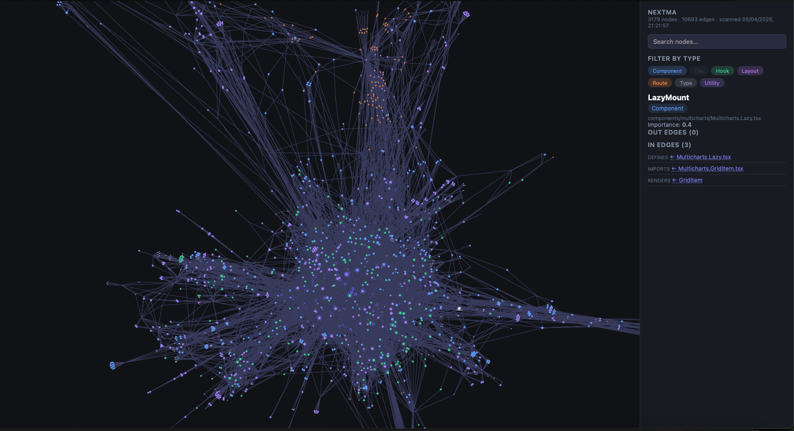

# nextma

**AI-ready knowledge layer for Next.js codebases.**

nextma scans your Next.js project once, builds a persistent knowledge graph, and exposes it through a built-in **MCP server** — so AI coding assistants (Claude Code, Cursor, Windsurf) query structured facts about your codebase instead of re-reading raw files on every prompt.

No embeddings. No vector database. No LLM required to build the graph.

---

## Why nextma

Most AI tools scan your files on every prompt and still miss the bigger picture — which components render where, what the route tree looks like, where the server/client boundary sits. nextma extracts all of that once and keeps it queryable.

- **Next.js aware** — App Router and Pages Router, layouts, routes, server/client boundaries, component trees, import graphs
- **MCP server built-in** — any MCP-compatible AI queries the graph with structured tools
- **Deterministic** — scan phase extracts facts only, no LLM needed
- **Incremental** — refresh only changed files after the initial scan

### nextma vs. plain search

| Task | Without nextma | With nextma |
|---|---|---|
| Find a hook by feature | `grep -r "balance"` → noise across files | `search_nodes({ label: "Hook", namePattern: "balance" })` → precise |
| Understand component relationships | Manually trace imports file by file | `get_relations(id)` → instant edges |
| Find where a hook is used | Multiple grep passes, manual dedup | `usageCount` in node metadata |
| See the full route tree | Read every `page.tsx` and `layout.tsx` | `get_route_tree()` → full hierarchy |
| Know if a component is server or client | Read file, check for `"use client"` | `isClient` / `isServer` on every node |
| Find something reusable before building | Hope you remember it exists | `find_reusable("modal")` → scored candidates |
| Map server/client boundary for a route | Trace RENDERS edges manually | `get_boundary_map(routeId)` → full map |

---

## Install

```bash
npm install -g @meodien99/nextma
```

Or build from source:

```bash
npm install && npm run build
```

---

## Core workflow

```bash
# 1. Scan your Next.js project
nextma scan --root ./my-app

# 2. Connect your AI tool via MCP (see below)

# 3. Re-scan after significant changes
nextma refresh --root ./my-app
```

That's it. Your AI tool now has structured, queryable context about your entire codebase.

---

## MCP server — AI integration

nextma ships a built-in MCP server (stdio transport). Connect it to any MCP-compatible AI tool:

**Compatible tools:**
- [Claude Code](https://claude.ai/code) (Anthropic)
- [Cursor](https://cursor.com)
- [Windsurf](https://windsurf.ai)
- Any tool supporting the [Model Context Protocol](https://modelcontextprotocol.io)

**Claude Code** — add `.mcp.json` to your project root:

```json
{
  "mcpServers": {
    "nextma": {
      "command": "nextma",
      "args": ["mcp", "--root", "/path/to/your/app"]
    }
  }
}
```

### Pre-task recon — the core pattern

Before writing any new code, run one call:

```
recon("your feature description", routeId?)
```

Returns in a single response:
- **Ranked candidates** — existing components, hooks, utilities relevant to your feature
- **Full shape** — edges, props, exports for each candidate
- **Render tree** — what each candidate renders
- **Boundary map** — server/client context for the route (if `routeId` provided)

This replaces 4 sequential tool calls. You get: **existing code → its shape → its render context** before writing a single line.

### `find_reusable` vs `search_nodes`

These are not the same tool:

| | `search_nodes` | `find_reusable` |
|---|---|---|
| Matching | Exact string match on name/path | Semantic ranking by relevance score |
| Input | `{ label, namePattern, pathPattern }` | Natural language query string |
| Use when | You know the name | You know the feature |

```
search_nodes({ namePattern: "balance" })         → finds nodes named "balance"
find_reusable("display token balance in UI")     → finds useTokenBalances, useTokenAccountStore,
                                                    and the store it depends on — ranked by score
```

`find_reusable` surfaces dependencies and related abstractions that a text search misses entirely.

### Available MCP tools

| Tool | Description |
|---|---|
| `recon` | **Start here.** One call returns ranked candidates + their shape + render tree + boundary map. Replaces 4 sequential calls. |
| `find_reusable` | Ranked search by natural language query — matches camelCase segments and dependency relationships, not just exact names |
| `search_nodes` | Find nodes by exact label, name, or path pattern |
| `get_node` | Full details of a node including all edges |
| `get_relations` | Edges from/to a node, filterable by kind (IMPORTS, RENDERS, CALLS…) |
| `get_component_tree` | Render tree rooted at a component |
| `get_boundary_map` | Server/client boundary map for a route — call before adding hooks to avoid RSC mistakes |
| `get_route_tree` | Full App Router / Pages Router hierarchy with layout nesting |
| `detect_changes` | Last scan timestamp — verify graph is fresh at session start |
| `figma_matches` | Figma → code matches for a parsed component (requires `figma-parse`) |

---

## Commands

### `nextma scan`

Scan a Next.js project and build the knowledge graph.

```bash
nextma scan [--root <path>] [--out <path>]
```

| Option | Default | Description |
|---|---|---|
| `--root` | `.` | Next.js project root |
| `--out` | `.context` | Output directory for `graph.db` |
| `--instruction <file>` | — | Append nextma MCP instructions to a file (e.g. `CLAUDE.md`, `.cursorrules`) |

---

### `nextma refresh`

Incrementally re-scan changed files only.

```bash
nextma refresh [--root <path>] [--out <path>]
```

Requires an existing scan. Much faster than a full scan on large codebases.

---

### `nextma mcp`

Start the MCP server (stdio transport).

```bash
nextma mcp [--out <path>] [--root <path>]
```

| Option | Default | Description |
|---|---|---|
| `--out` | `.context` | Context directory containing `graph.db` |
| `--root` | `.` | Project root |

---

### `nextma visualize`

Open a local graph viewer in the browser.

```bash
nextma visualize [--out <path>] [--port <number>]
```

| Option | Default | Description |
|---|---|---|
| `--out` | `.context` | Context directory |
| `--port` | `4321` | Port to serve on |

---


## Optional: Figma → code generation

If your team works with Figma, `figma-parse` extends the graph with design intent and generates structured codegen guides for your AI tool.

```bash
# New component
nextma figma-parse https://www.figma.com/design/...

# Update an existing component (refreshes design files, preserves your codegen-guide.md edits)
nextma figma-parse https://www.figma.com/design/... --update

# Update with a known source path (written into update-guide.md for Claude)
nextma figma-parse https://www.figma.com/design/... --update --existing src/components/ui/button.tsx
```

Requires `FIGMA_ACCESS_TOKEN` in your environment or `.env` file.

Outputs to `.context/figma/<component-slug>/`:

| File | New | Update |
|---|---|---|
| `meta.json` | created | overwritten |
| `figma-node.json` | created | overwritten |
| `preview.png` | created | overwritten |
| `design-intent.md` | created | overwritten |
| `codegen-guide.md` | created | **preserved** |
| `prepare.md` | created | — |
| `update-guide.md` | — | created |

The parsed component is linked into `graph.db` via `FIGMA_MAPS_TO` edges — so `figma_matches("button")` returns existing code components that correspond to the design.

**New component** — open Claude Code and run:
```
Read .context/figma/<component-slug>/prepare.md and follow the steps
```

**Update existing component** — open Claude Code and run:
```
Read .context/figma/<component-slug>/update-guide.md and follow the steps
```

The update guide tells Claude to read your existing source file first, identify what changed in the design, check for callers before changing props, then present a diff for confirmation before touching any code.

Get a Figma personal access token at **Figma → Account settings → Personal access tokens**. Never commit `.env` to source control.

---

## How it works

```
nextma scan         →  deterministic graph of files, components, routes, edges
nextma refresh      →  incremental update on file changes
nextma mcp          →  structured query interface for AI tools
nextma figma-parse  →  (optional) Figma node → design intent + codegen guide
```

The `.context/` directory is a lightweight knowledge layer, not a replacement for source code. It reduces AI search space so tools only inspect a small number of relevant files per prompt.

---

## Scope

nextma is intentionally scoped to **Next.js** codebases (App Router and Pages Router). It is not a general-purpose code indexer.

---

## Author

mad cat — [seb.madcat@gmail.com](mailto:seb.madcat@gmail.com)

## License

MIT
